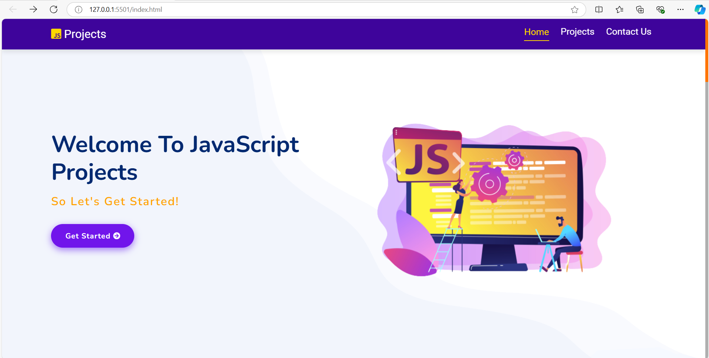

## JavaScript-Projects

The JavaScript Projects Site is a centralized platform housing significant projects, all accessible from a single location. 

Crafted using fundamental technologies like HTML, CSS, TailwindCSS, SCSS, JavaScript, and jQuery, it offers a seamless experience for project exploration and engagement.

[Visit Now](https://github.com/UdayGavada.io/JavaScript-Projects) 🚀

## Sneak Peek of Home Page 🙈 :

<h2>📬 Contact</h2>

Feel free to reach me through the below handles if you'd like to contact me.

